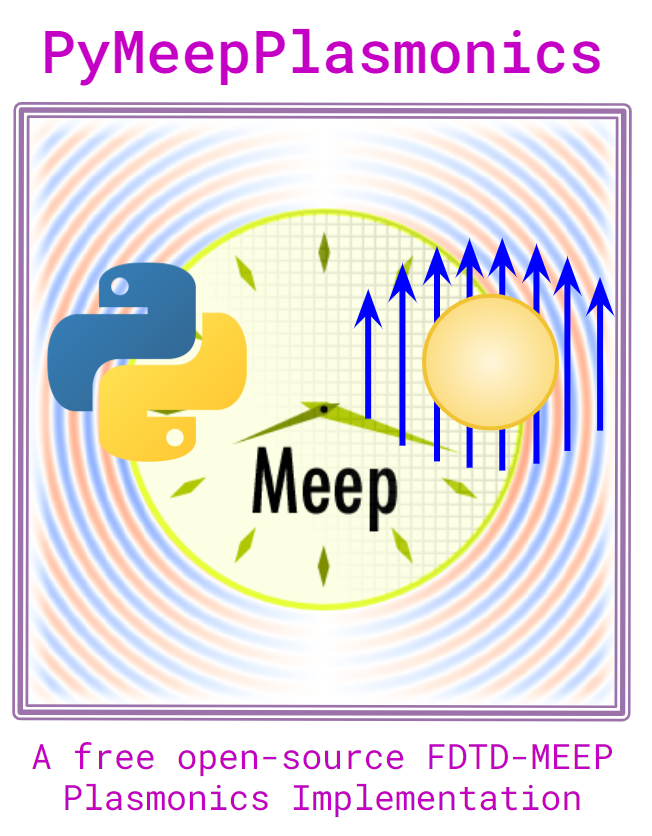
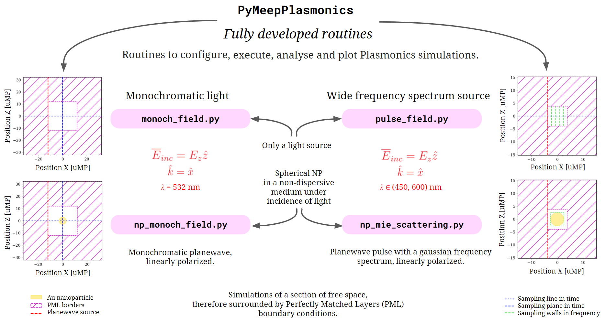
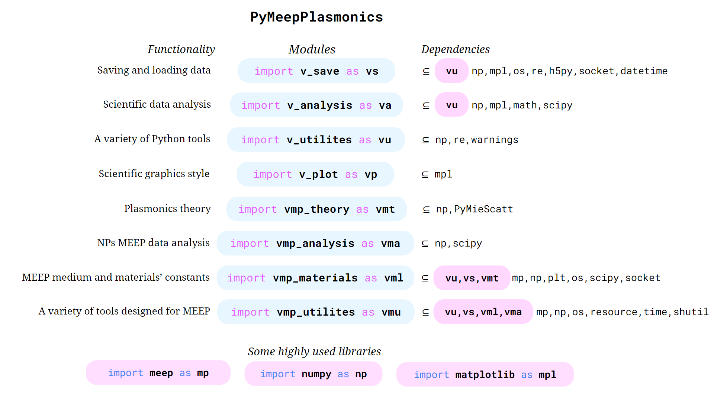

# PyMeepPlasmonics

Free and open-source code package designed to perform PyMEEP FDTD simulations applied to Plasmonics.

## About

`PyMeepPlasmonics` is a freely accesible FDTD-MEEP implementation that contains code modules and routine scripts that allow for serial and parallel Plasmonics simulations to be run both in personal computers and clusters. 

  

`PyMeepPlasmonics` allows to perform **Finite-Differences Time-Domain (FDTD) simulations**, where a certain domain is discretized both in space and time in order to simulate the electromagnetic response in time by advancing step-by-step the electromagnetic field evaluated in each and every position or node. It uses a free and open-source FDTD implementation called **MIT Electromagnetic Propagation (MEEP)**. [MEEP](https://meep.readthedocs.io/en/latest/) has been cited in many scientific publications and it holds a Python library that offers great flexibility and versatibility while allowing users to create customized scripts and routines.

`PyMeepPlasmonics` aims to apply PyMEEP FDTD simulations to the nanoscale and it is particularly focused in studying the optical properties of metallic nanoparticles (NPs). It has four fully equiped routines that configure and perform simulations to extract, analyse and save data both in time-domain (direct electromagnetic field calculations) and in frequency domain (indirect scattering cross section calculations).

  

In order to build these routines, several code modules are used, each and every one of them highly documented. By calling functions from these modules and combining them with other famous scientific packages such as `numpy` or `matplotlib`, `PyMeepPlasmonics` should be able to present you with a whole spectrum of possibilities that will help you build your own Plasmonics or Nanophysics simulations.

  

## Installation

### Ubuntu

A series of simple instructions can be followed to install the required packages in Ubuntu 20.04 LTS or any newer Ubuntu OS. 

The steps are slightly different whether you intend to run MEEP simulations using serial execution or parallel execution. If you have not decided yet, by following the instructions below you can actually have two Anaconda environments installed at the same time, one intended for serial execution and the other one for parallel execution.

#### Serial execution

- First, install the [Miniconda](https://docs.anaconda.com/anaconda/install/linux/) distribution.
- You might need to activate Anaconda from an Ubuntu terminal by using the command `conda init`.
- You can then create a Conda environment for MEEP using the command `conda create -n mp -c conda-forge pymeep`.
- To start using the environment you will need to activate it by using `conda activate mp`.
- Additional packages you might want to install using `conda install` or `pip install` include `h5py` for HDF files management, `resource` for monitoring resources such as RAM consumption and `imageio` for making gifs.
- It might also come in handy installing Spyder for interactive serial execution and it is highly recommended to install `click` for console serial execution.

#### Parallel execution

- First, install the [Miniconda](https://docs.anaconda.com/anaconda/install/linux/) distribution.
- You might need to activate Anaconda from an Ubuntu terminal by using the command `conda init`.
- You can then create a Conda environment for MEEP using the command `conda create -n pmp -c conda-forge pymeep=*=mpi_mpich_*`.
- To start using the environment you will need to activate it by using `conda activate pmp`.
- Additional packages you might want to install using `conda install` or `pip install` include `h5py` for HDF files management, `resource` for monitoring resources such as RAM consumption and `imageio` for making gifs.
- It is highly recommended to install `click` for parallel serial execution.

### Windows

As required by MEEP, an Ubuntu OS will be necessary, so if you wish to work in Windows you will need a virtual machine or similar. Up to date, only Ubuntu has been used to execute `PyMeepPlasmonic` simulations, so saddly you will need to find out how to install it yourself.

## Usage

First, you need to configure your system's setup. The suggested way to do this is to use the automatic setup provided by `PyMeepPlasmonics`. To do this, you will need to follow these steps:

- Open an Anaconda Prompt console and go to your repository's directory by running `cd my\route\to\SinglePixelImaging`.
- Call the module `v_save` as an executable file by using the command `python v_save.py`.
- Follow the instructions in the screen:
    - First, indicate a nickname for your current PC and system.
    - Then, make sure the detected route to the repository is correct.
    - Finally, choose a path to a folder where the results will be saved.
- A configuration file named "SystemDirectories.txt" will have been created at your repository's folder and you will be ready to go.

Once you have finished, you will be able to open, inspect and execute those scripts that are already created to perform single-pixel simulations. Hopefully they will provide you with the results you are looking for. If not, they will surely provide you with enough examples to build your own simulation :)

## Licence

Free open-source code developed as part of a Master Thesis Project in Physics.

***FDTD Applications To The Nanoscale: Photonics & Plasmonics Through MEEP***

Development by Valeria R. Pais, [DF, FCEyN, UBA](https://sitio.df.uba.ar/es/)

Direction by Prof. Dr. Fernando D. Stefani, [Applied Nanophysics Group, CIBION, CONICET](https://stefani-lab.ar/)

